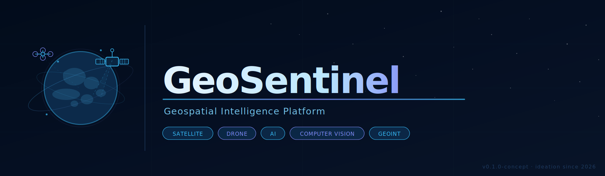
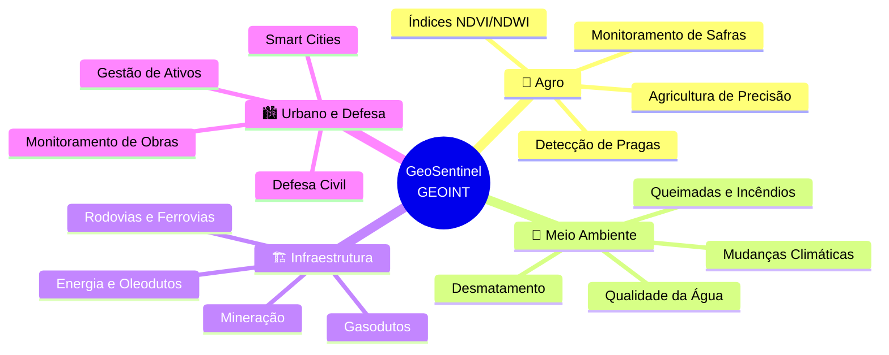
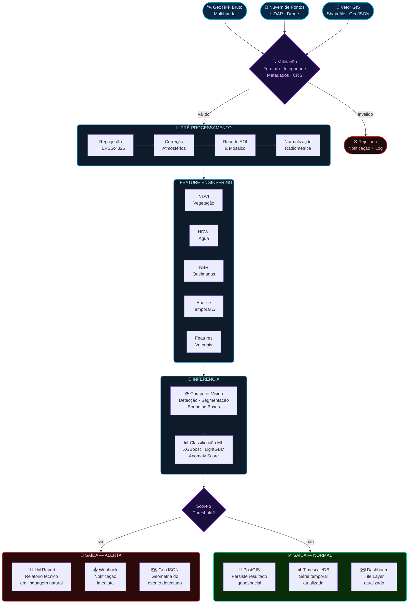
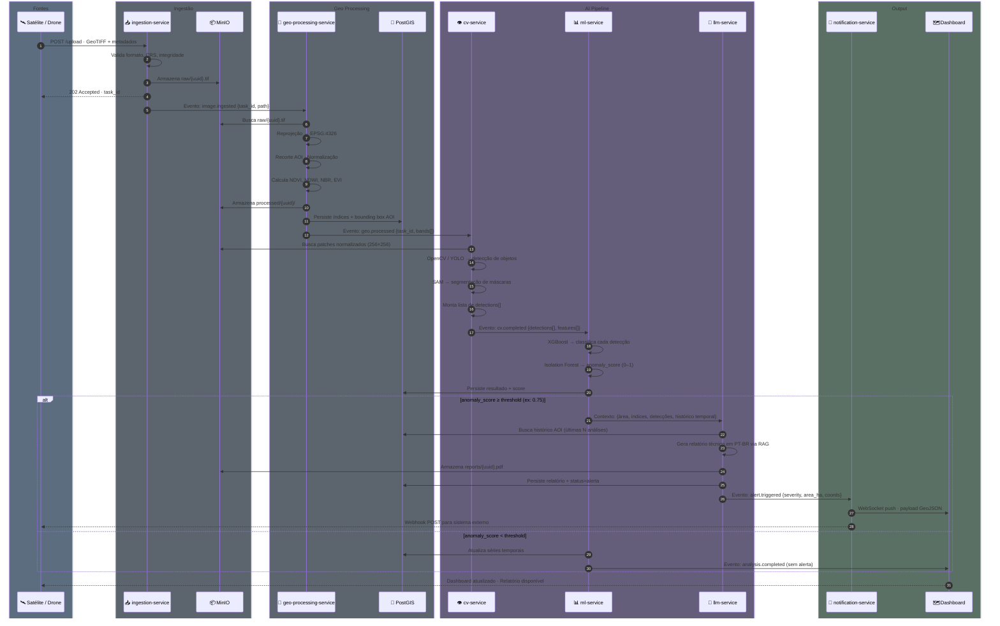
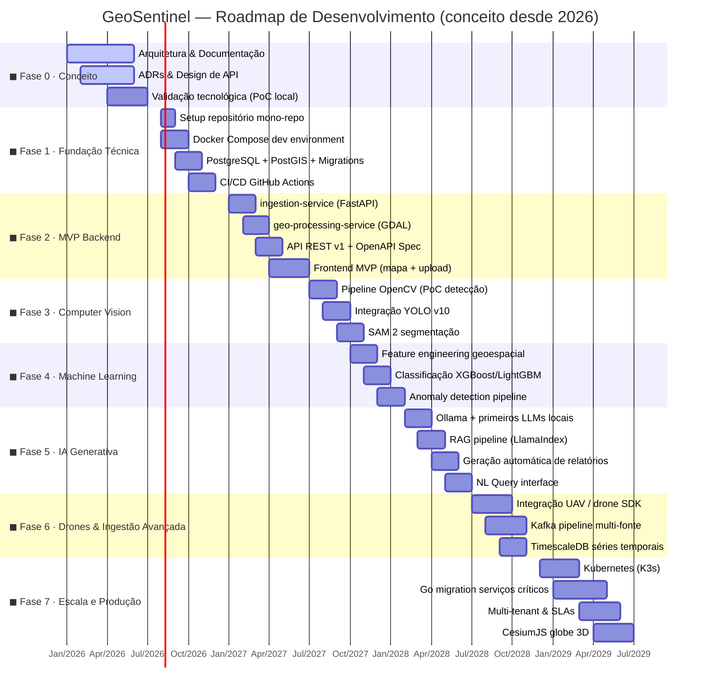
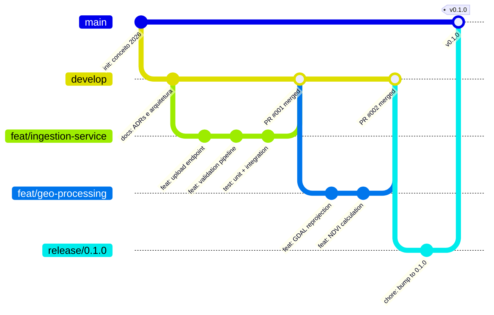

<div align="center">  <br/>
  
<div align="center">

<svg xmlns="http://www.w3.org/2000/svg" viewBox="0 0 960 280" width="960" height="280">
  <defs>
    <linearGradient id="bgGrad" x1="0%" y1="0%" x2="100%" y2="100%">
      <stop offset="0%"   style="stop-color:#020c1b;stop-opacity:1"/>
      <stop offset="50%"  style="stop-color:#050f22;stop-opacity:1"/>
      <stop offset="100%" style="stop-color:#081428;stop-opacity:1"/>
    </linearGradient>
    <linearGradient id="accentGrad" x1="0%" y1="0%" x2="100%" y2="0%">
      <stop offset="0%"   style="stop-color:#38bdf8;stop-opacity:1"/>
      <stop offset="50%"  style="stop-color:#818cf8;stop-opacity:1"/>
      <stop offset="100%" style="stop-color:#38bdf8;stop-opacity:1"/>
    </linearGradient>
    <linearGradient id="titleGrad" x1="0%" y1="0%" x2="100%" y2="0%">
      <stop offset="0%"   style="stop-color:#e0f2fe;stop-opacity:1"/>
      <stop offset="60%"  style="stop-color:#bae6fd;stop-opacity:1"/>
      <stop offset="100%" style="stop-color:#818cf8;stop-opacity:1"/>
    </linearGradient>
    <linearGradient id="orbitGrad" x1="0%" y1="0%" x2="100%" y2="100%">
      <stop offset="0%"   style="stop-color:#38bdf8;stop-opacity:0.6"/>
      <stop offset="100%" style="stop-color:#818cf8;stop-opacity:0.1"/>
    </linearGradient>
    <filter id="glow" x="-20%" y="-20%" width="140%" height="140%">
      <feGaussianBlur stdDeviation="2.5" result="coloredBlur"/>
      <feMerge><feMergeNode in="coloredBlur"/><feMergeNode in="SourceGraphic"/></feMerge>
    </filter>
    <filter id="titleglow" x="-10%" y="-30%" width="120%" height="160%">
      <feGaussianBlur stdDeviation="6" result="coloredBlur"/>
      <feMerge><feMergeNode in="coloredBlur"/><feMergeNode in="SourceGraphic"/></feMerge>
    </filter>
    <filter id="subtleglow" x="-5%" y="-20%" width="110%" height="140%">
      <feGaussianBlur stdDeviation="1.5" result="coloredBlur"/>
      <feMerge><feMergeNode in="coloredBlur"/><feMergeNode in="SourceGraphic"/></feMerge>
    </filter>
    <radialGradient id="scanGrad" cx="50%" cy="50%" r="50%">
      <stop offset="0%"   style="stop-color:#38bdf8;stop-opacity:0.15"/>
      <stop offset="100%" style="stop-color:#38bdf8;stop-opacity:0"/>
    </radialGradient>
    <mask id="earthMask">
      <circle cx="128" cy="140" r="58" fill="white"/>
    </mask>
  </defs>

  <!-- Background -->
  <rect width="960" height="280" fill="url(#bgGrad)"/>

  <!-- Grid overlay for modern tech feel -->
  <g opacity="0.03" stroke="#38bdf8" stroke-width="0.5">
    <line x1="0" y1="70"  x2="960" y2="70"/>
    <line x1="0" y1="140" x2="960" y2="140"/>
    <line x1="0" y1="210" x2="960" y2="210"/>
    <line x1="240" y1="0" x2="240" y2="280"/>
    <line x1="480" y1="0" x2="480" y2="280"/>
    <line x1="720" y1="0" x2="720" y2="280"/>
  </g>

  <!-- Star field -->
  <g fill="#ffffff" opacity="0.35">
    <circle cx="520" cy="22"  r="0.8"/><circle cx="610" cy="45"  r="0.6"/>
    <circle cx="700" cy="18"  r="1.0"/><circle cx="780" cy="55"  r="0.7"/>
    <circle cx="840" cy="30"  r="0.5"/><circle cx="900" cy="70"  r="0.9"/>
    <circle cx="560" cy="70"  r="0.6"/><circle cx="640" cy="90"  r="0.8"/>
    <circle cx="720" cy="75"  r="0.5"/><circle cx="820" cy="85"  r="0.7"/>
    <circle cx="870" cy="110" r="0.6"/><circle cx="930" cy="40"  r="0.8"/>
    <circle cx="475" cy="55"  r="0.5"/><circle cx="950" cy="95"  r="0.6"/>
    <circle cx="530" cy="100" r="0.7"/><circle cx="760" cy="30"  r="0.5"/>
    <circle cx="430" cy="38"  r="0.6"/><circle cx="490" cy="130" r="0.4"/>
    <circle cx="660" cy="120" r="0.5"/><circle cx="750" cy="110" r="0.6"/>
    <circle cx="580" cy="145" r="0.4"/><circle cx="690" cy="155" r="0.5"/>
    <circle cx="810" cy="140" r="0.6"/><circle cx="880" cy="160" r="0.4"/>
    <circle cx="920" cy="130" r="0.7"/><circle cx="950" cy="185" r="0.5"/>
  </g>

  <!-- Earth sphere -->
  <circle cx="128" cy="140" r="58" fill="#0c2a4a" filter="url(#subtleglow)"/>
  <circle cx="128" cy="140" r="58" fill="none" stroke="#38bdf8" stroke-width="0.8" opacity="0.5"/>

  <!-- Earth continents (stylized) -->
  <g mask="url(#earthMask)" fill="#1a4a6e" opacity="0.8">
    <ellipse cx="118" cy="122" rx="18" ry="14"/>
    <ellipse cx="145" cy="132" rx="12" ry="10"/>
    <ellipse cx="105" cy="150" rx="22" ry="9"/>
    <ellipse cx="138" cy="158" rx="10" ry="8"/>
    <ellipse cx="160" cy="148" rx="8"  ry="6"/>
    <ellipse cx="108" cy="118" rx="8"  ry="6"/>
    <ellipse cx="118" cy="165" rx="6"  ry="5"/>
  </g>
  <!-- Earth glow rim -->
  <circle cx="128" cy="140" r="58" fill="none" stroke="#38bdf8" stroke-width="2" opacity="0.2"/>
  <circle cx="128" cy="140" r="62" fill="none" stroke="#818cf8" stroke-width="1" opacity="0.08"/>

  <!-- Orbit rings -->
  <ellipse cx="128" cy="140" rx="88" ry="22" fill="none" stroke="url(#orbitGrad)" stroke-width="0.8" opacity="0.5" transform="rotate(-20 128 140)"/>
  <ellipse cx="128" cy="140" rx="72" ry="18" fill="none" stroke="#38bdf8" stroke-width="0.5" opacity="0.2" transform="rotate(15 128 140)"/>

  <!-- Satellite on orbit -->
  <g transform="translate(178, 98)" filter="url(#glow)">
    <rect x="-10" y="-7" width="20" height="14" rx="2" fill="#0a2540" stroke="#38bdf8" stroke-width="1.2"/>
    <rect x="-26" y="-4" width="14" height="8" rx="1" fill="#0a2540" stroke="#38bdf8" stroke-width="0.8"/>
    <line x1="-19" y1="-4" x2="-19" y2="4" stroke="#38bdf8" stroke-width="0.4"/>
    <line x1="-15" y1="-4" x2="-15" y2="4" stroke="#38bdf8" stroke-width="0.4"/>
    <rect x="12"  y="-4" width="14" height="8" rx="1" fill="#0a2540" stroke="#38bdf8" stroke-width="0.8"/>
    <line x1="16"  y1="-4" x2="16"  y2="4" stroke="#38bdf8" stroke-width="0.4"/>
    <line x1="20"  y1="-4" x2="20"  y2="4" stroke="#38bdf8" stroke-width="0.4"/>
    <line x1="0" y1="-7" x2="0" y2="-16" stroke="#38bdf8" stroke-width="0.9"/>
    <circle cx="0" cy="-18" r="2.5" fill="none" stroke="#38bdf8" stroke-width="0.8"/>
  </g>

  <!-- Scan cone from satellite to earth -->
  <polygon points="178,96 148,150 160,155" fill="url(#scanGrad)" opacity="0.4"/>
  <line x1="178" y1="96" x2="148" y2="150" stroke="#38bdf8" stroke-width="0.6" opacity="0.3" stroke-dasharray="3 3"/>
  <line x1="178" y1="96" x2="160" y2="155" stroke="#38bdf8" stroke-width="0.6" opacity="0.3" stroke-dasharray="3 3"/>

  <!-- Drone (upper right of globe) -->
  <g transform="translate(68, 86)" filter="url(#glow)" opacity="0.9">
    <line x1="-12" y1="0" x2="12" y2="0" stroke="#38bdf8" stroke-width="1"/>
    <line x1="0" y1="-6" x2="0" y2="6" stroke="#38bdf8" stroke-width="1"/>
    <circle cx="-12" cy="0" r="4" fill="none" stroke="#818cf8" stroke-width="0.8"/>
    <circle cx="12"  cy="0" r="4" fill="none" stroke="#818cf8" stroke-width="0.8"/>
    <circle cx="0" cy="-6"  r="4" fill="none" stroke="#818cf8" stroke-width="0.8"/>
    <circle cx="0" cy="6"   r="4" fill="none" stroke="#818cf8" stroke-width="0.8"/>
    <circle cx="0" cy="0"   r="3" fill="#0a2540" stroke="#38bdf8" stroke-width="1"/>
  </g>

  <!-- Signal dots -->
  <g fill="#38bdf8" opacity="0.7" filter="url(#subtleglow)">
    <circle cx="92"  cy="98"  r="1.5"/>
    <circle cx="160" cy="80"  r="1.5"/>
    <circle cx="74"  cy="182" r="1.5"/>
  </g>
  <line x1="68" y1="92" x2="128" y2="142" stroke="#38bdf8" stroke-width="0.5" opacity="0.15" stroke-dasharray="2 4"/>

  <!-- Divider line (vertical) -->
  <line x1="230" y1="40" x2="230" y2="240" stroke="#1e3a5f" stroke-width="0.8"/>

  <!-- Accent bar under title -->
  <rect x="258" y="157" width="480" height="2" rx="1" fill="url(#accentGrad)" opacity="0.85" filter="url(#subtleglow)"/>

  <!-- Main title -->
  <text x="258" y="148"
        font-family="'Segoe UI', 'Inter', 'SF Pro Display', 'Helvetica Neue', Arial, sans-serif"
        font-size="58" font-weight="800" letter-spacing="-2"
        fill="url(#titleGrad)" filter="url(#titleglow)">GeoSentinel</text>

  <!-- Tagline -->
  <text x="260" y="182"
        font-family="'Segoe UI', 'Inter', 'SF Pro Text', Arial, sans-serif"
        font-size="14.5" font-weight="300" fill="#7dd3fc" letter-spacing="0.8" opacity="0.9">
    Geospatial Intelligence Platform
  </text>

  <!-- Pills row -->
  <rect x="258" y="202" width="80" height="20" rx="10" fill="#0c2a4a" stroke="#38bdf8" stroke-width="0.7" opacity="0.9"/>
  <text x="298" y="216" font-family="'Fira Code','Courier New',monospace" font-size="8.5" fill="#38bdf8" text-anchor="middle" letter-spacing="0.5">SATELLITE</text>
  <rect x="346" y="202" width="60" height="20" rx="10" fill="#0c2a4a" stroke="#818cf8" stroke-width="0.7" opacity="0.9"/>
  <text x="376" y="216" font-family="'Fira Code','Courier New',monospace" font-size="8.5" fill="#818cf8" text-anchor="middle" letter-spacing="0.5">DRONE</text>
  <rect x="414" y="202" width="38" height="20" rx="10" fill="#0c2a4a" stroke="#38bdf8" stroke-width="0.7" opacity="0.9"/>
  <text x="433" y="216" font-family="'Fira Code','Courier New',monospace" font-size="8.5" fill="#38bdf8" text-anchor="middle" letter-spacing="0.5">AI</text>
  <rect x="460" y="202" width="118" height="20" rx="10" fill="#0c2a4a" stroke="#818cf8" stroke-width="0.7" opacity="0.9"/>
  <text x="519" y="216" font-family="'Fira Code','Courier New',monospace" font-size="8.5" fill="#818cf8" text-anchor="middle" letter-spacing="0.5">COMPUTER VISION</text>
  <rect x="586" y="202" width="64" height="20" rx="10" fill="#0c2a4a" stroke="#38bdf8" stroke-width="0.7" opacity="0.9"/>
  <text x="618" y="216" font-family="'Fira Code','Courier New',monospace" font-size="8.5" fill="#38bdf8" text-anchor="middle" letter-spacing="0.5">GEOINT</text>

  <!-- Bottom-right version -->
  <text x="945" y="268" font-family="'Fira Code','Courier New',monospace"
        font-size="8" fill="#1e3a5f" text-anchor="end" letter-spacing="1">v0.1.0-concept · ideation since 2026</text>
</svg>

<br/>

[](.)
[](.)
[](.)
[](./LICENSE)
[](.)
[](.)
[](.)
[](.)

<br/>

> **Transformando dados geoespaciais em inteligência acionável.**
> Satélites · Drones · IA · Computer Vision · Analytics · Segurança.
>
> ⚠️ *Projeto em fase inicial de conceituação e planejamento arquitetural. A ideia nasceu em 2026 e, atualmente, encontra-se na Fase 0 — sem código de produção publicado. Os diagramas e documentos aqui presentes representam a direção técnica planejada.*

</div>

---

## 📖 Índice

- [Sobre](#-sobre)
- [Por que GeoSentinel?](#-por-que-geosentinel)
- [Comparativo com Soluções Existentes](#-comparativo-com-soluções-existentes)
- [Casos de Uso](#-casos-de-uso)
- [Arquitetura](#-arquitetura)
  - [Visão em Camadas](#-visão-em-camadas)
  - [Pipeline de Dados Geoespaciais](#-pipeline-de-dados-geoespaciais)
  - [Arquitetura de Microsserviços](#-arquitetura-de-microsserviços)
  - [Fluxo CV → ML → LLM](#-fluxo-cv--ml--llm)
  - [Modelo de Segurança](#-modelo-de-segurança)
- [Stack Tecnológica](#-stack-tecnológica)
- [Roadmap](#-roadmap)
- [Estrutura do Repositório](#-estrutura-do-repositório)
- [Documentação da API](#-documentação-da-api)
- [Mockups do Dashboard](#-mockups-do-dashboard)
- [Decisões Arquiteturais (ADR)](#-decisões-arquiteturais-adr)
- [Guia para Contribuidores](#-guia-para-contribuidores)
- [Licença](#-licença)

---

## 📌 Sobre

O **GeoSentinel** é uma plataforma de **Geospatial Intelligence (GEOINT)** concebida em **2026** com o objetivo de integrar sensoriamento remoto, visão computacional, aprendizado de máquina e IA generativa, transformando dados geoespaciais brutos em inteligência acionável para organizações públicas e privadas.

> **Status atual:** Fase 0 — conceituação, arquitetura e documentação. O projeto ainda não possui código de produção publicado. Todos os diagramas, especificações e decisões técnicas aqui documentados representam o planejamento e a direção pretendida para o desenvolvimento futuro.

A plataforma foi projetada desde sua concepção com os princípios de **Security by Design**, **API First**, **Cloud Native** e **IA integrada ao fluxo geoespacial** — não como add-ons posteriores.

| Pilar | Direção Técnica |
|---|---|
| 🛰️ Sensoriamento Remoto | Satélites (Sentinel-2, Landsat, Planet), Drones UAV |
| 🗺️ Processamento Geoespacial | PostGIS, GDAL, Rasterio, GeoPandas |
| 👁️ Computer Vision | OpenCV (MVP) → YOLO, SAM, Detectron2 (produção) |
| 🤖 Machine Learning | XGBoost, LightGBM, CatBoost, Scikit-learn |
| 🧠 IA Generativa | LLMs open-weight via Ollama (agnóstico ao provedor) |
| 🔒 Segurança | OAuth2, JWT, RBAC, OPA, Keycloak |
| 📊 Observabilidade | OpenTelemetry, Prometheus, Grafana |

---

## 🎯 Por que GeoSentinel?

A maioria das soluções GEOINT existentes resolve apenas parte do problema: ou são excelentes em visualização mas carecem de IA nativa, ou possuem ML avançado mas não integram dados de múltiplas fontes de sensoriamento. O GeoSentinel fecha essa lacuna com uma arquitetura unificada que vai da ingestão de imagens brutas até relatórios gerados por LLM.

```
Problema atual              Visão GeoSentinel
────────────────────────    ──────────────────────────────────────────
Dados isolados por fonte    Pipeline unificado multi-fonte
BI genérico sem contexto    Analytics geoespacial nativo
IA desacoplada do fluxo     CV + ML + LLM integrados na pipeline
Relatórios manuais lentos   Geração automática por IA generativa
Silos de segurança          Security by Design desde a ingestão
Lock-in de provedor de IA   Arquitetura agnóstica (open-weight)
```

---

## ⚖️ Comparativo com Soluções Existentes

| Critério | GeoSentinel | Esri ArcGIS | Google Earth Engine | Palantir Gotham | Mapbox |
|---|:---:|:---:|:---:|:---:|:---:|
| Open-weight LLMs integrados | ✅ Planejado | ❌ | ❌ | Parcial | ❌ |
| Pipeline CV → ML nativo | ✅ Planejado | ❌ | Parcial | ✅ | ❌ |
| Self-hosted / On-premises | ✅ | ✅ | ❌ | ❌ | ❌ |
| API First | ✅ | Parcial | ✅ | ❌ | ✅ |
| Relatórios gerados por IA | ✅ Planejado | ❌ | ❌ | Parcial | ❌ |
| PostGIS nativo | ✅ | ❌ | ❌ | ❌ | ❌ |
| Agnóstico a provedores de IA | ✅ | ❌ | ❌ | ❌ | ❌ |
| Custo de entrada | A definir | Alto | Médio | Muito Alto | Médio |

> **Nota:** Comparativo baseado em features públicas documentadas. Avaliação independente, sem vínculo comercial. Features marcadas como "Planejado" ainda não foram implementadas — o projeto encontra-se em fase de conceito desde 2026.

---

## 💼 Casos de Uso



---

## 🏗️ Arquitetura

> ⚠️ **Nota de Estado:** Os diagramas abaixo representam a arquitetura planejada e concebida em 2026. Nenhum componente foi implementado em produção ainda. Esta seção serve como referência técnica para o desenvolvimento futuro.

### 🔷 Visão em Camadas

A arquitetura do GeoSentinel é organizada em seis camadas funcionais verticais, do sensoriamento à apresentação, com uma camada horizontal de segurança e outra de observabilidade cobrindo toda a stack.

```mermaid
graph TB
    %% ═══════════════════════════════════════════════════════════
    %% CAMADA 1 — FONTES DE DADOS
    %% ═══════════════════════════════════════════════════════════
    subgraph L1["🛰️  CAMADA 1 · FONTES DE DADOS"]
        direction LR
        SAT["🛰️ Satélites<br/>Sentinel-2 · Landsat · Planet"]
        DRN["🚁 Drones / UAV<br/>Imagens · LiDAR · Vídeo"]
        GIS["🗺️ APIs GIS<br/>OSM · WMS · WFS · STAC"]
        IOT["📡 Sensores IoT<br/>Estações · Câmeras"]
    end

    %% ═══════════════════════════════════════════════════════════
    %% CAMADA 2 — INGESTÃO E ARMAZENAMENTO
    %% ═══════════════════════════════════════════════════════════
    subgraph L2["📥  CAMADA 2 · INGESTÃO E ARMAZENAMENTO BRUTO"]
        direction LR
        QUEUE["⚙️ Task Queue<br/>Celery + Redis<br/><i>MVP</i>"]
        BROKER["📨 Message Bus<br/>Apache Kafka<br/><i>Produção</i>"]
        OBJSTORE["🗄️ Object Storage<br/>MinIO · S3<br/>GeoTIFF · JP2"]
    end

    %% ═══════════════════════════════════════════════════════════
    %% CAMADA 3 — PROCESSAMENTO GEOESPACIAL
    %% ═══════════════════════════════════════════════════════════
    subgraph L3["📐  CAMADA 3 · PROCESSAMENTO GEOESPACIAL"]
        direction LR
        GDAL_N["🔧 GDAL<br/>Reprojeção · Mosaico<br/>Recorte AOI"]
        RASTER_N["📊 Rasterio<br/>Análise Raster<br/>Bandas Espectrais"]
        INDICES_N["📐 Índices<br/>NDVI · NDWI · EVI<br/>NBR · SAVI"]
        POSTGIS_N["🐘 PostGIS<br/>Queries Espaciais<br/>ST_Intersects · ST_Area"]
    end

    %% ═══════════════════════════════════════════════════════════
    %% CAMADA 4 — INTELIGÊNCIA ARTIFICIAL
    %% ═══════════════════════════════════════════════════════════
    subgraph L4["🤖  CAMADA 4 · INTELIGÊNCIA ARTIFICIAL"]
        direction TB
        subgraph CV_BOX["👁️ Computer Vision"]
            direction LR
            CV1["OpenCV<br/><i>MVP</i>"]
            CV2["YOLO v10<br/>Detecção"]
            CV3["SAM 2<br/>Segmentação"]
        end
        subgraph ML_BOX["📈 Machine Learning"]
            direction LR
            ML1["XGBoost<br/>Classificação"]
            ML2["Isolation Forest<br/>Anomalias"]
            ML3["TimeSeries<br/>Previsão"]
        end
        subgraph GEN_BOX["🧠 IA Generativa"]
            direction LR
            LLM1["Ollama<br/>Inferência Local"]
            LLM2["LlamaIndex<br/>RAG Pipeline"]
            LLM3["NL Query<br/>Interface"]
        end
    end

    %% ═══════════════════════════════════════════════════════════
    %% CAMADA 5 — BACKEND E APIs
    %% ═══════════════════════════════════════════════════════════
    subgraph L5["⚡  CAMADA 5 · BACKEND E APIs"]
        direction LR
        GW_N["🔀 API Gateway<br/>Traefik · Rate Limit"]
        API_N["⚡ FastAPI<br/>REST · WebSocket<br/><i>MVP</i>"]
        GO_N["🚀 Go Services<br/>Alta Performance<br/><i>Produção</i>"]
        AUTH_N["🔐 Auth<br/>Keycloak · OPA · JWT"]
    end

    %% ═══════════════════════════════════════════════════════════
    %% CAMADA 6 — APRESENTAÇÃO
    %% ═══════════════════════════════════════════════════════════
    subgraph L6["🖥️  CAMADA 6 · APRESENTAÇÃO"]
        direction LR
        MAP_N["🗺️ Mapa Interativo<br/>Leaflet · Next.js"]
        GLOBE_N["🌍 Globe 3D<br/>CesiumJS"]
        ALERTS_N["🔔 Alertas<br/>Real-time WS"]
        REPORT_N["📄 Relatórios<br/>PDF · Export"]
    end

    %% ═══════════════════════════════════════════════════════════
    %% CAMADAS HORIZONTAIS
    %% ═══════════════════════════════════════════════════════════
    subgraph SEC["🔒  SEGURANÇA TRANSVERSAL"]
        direction LR
        S1["mTLS entre serviços"]
        S2["Secrets: Vault"]
        S3["Audit Logs"]
        S4["RBAC · OPA Policies"]
    end

    subgraph OBS["📊  OBSERVABILIDADE"]
        direction LR
        O1["OpenTelemetry<br/>Traces · Metrics"]
        O2["Prometheus<br/>Alertmanager"]
        O3["Grafana<br/>Dashboards"]
        O4["Loki<br/>Logs"]
    end

    %% ═══════════════════════════════════════════════════════════
    %% FLUXO PRINCIPAL
    %% ═══════════════════════════════════════════════════════════
    L1 ==>|"dados brutos"| L2
    L2 ==>|"artefatos validados"| L3
    L3 ==>|"features geoespaciais"| L4
    L4 ==>|"resultados + alertas"| L5
    L5 ==>|"API responses"| L6

    L5 -.->|"telemetria"| OBS
    SEC -.->|"protege"| L2
    SEC -.->|"protege"| L3
    SEC -.->|"protege"| L4
    SEC -.->|"protege"| L5

    %% ═══════════════════════════════════════════════════════════
    %% ESTILOS PROFISSIONAIS
    %% ═══════════════════════════════════════════════════════════
    classDef layerBox fill:#0d1b2a,stroke:#1b4965,stroke-width:2px,color:#cae9ff,rx:12,ry:12
    classDef subBox fill:#0a1520,stroke:#2a6f97,stroke-width:1.5px,color:#a8dadc
    classDef crossBox fill:#0a0f1a,stroke:#415a77,stroke-width:1.5px,color:#778da9,rx:10,ry:10

    class L1,L2,L3,L4,L5,L6 layerBox
    class CV_BOX,ML_BOX,GEN_BOX subBox
    class SEC,OBS crossBox
```



---

### 🔷 Pipeline de Dados Geoespaciais

Fluxo detalhado de uma imagem de satélite desde a ingestão até a geração do alerta inteligente.



---

### 🔷 Arquitetura de Microsserviços

```mermaid
graph TB
    %% ═══════════════════════════════════════════════════════════
    %% CLIENTES
    %% ═══════════════════════════════════════════════════════════
    subgraph CLIENTS["  💻 CLIENTES  "]
        direction LR
        WEB["🌐 Web App<br/>Next.js"]
        MOB["📱 Mobile<br/><i>Futuro</i>"]
        EXTAPI["🔌 API Clients<br/>Integrações"]
    end

    %% ═══════════════════════════════════════════════════════════
    %% GATEWAY & AUTH
    %% ═══════════════════════════════════════════════════════════
    GW_SVC["🔀 API Gateway<br/>Traefik<br/>Rate Limit · TLS · Routing"]

    AUTH_SVC["🔐 Auth Service<br/>Keycloak + OPA<br/>SSO · JWT · RBAC · Policy"]

    %% ═══════════════════════════════════════════════════════════
    %% SERVIÇOS DE DOMÍNIO
    %% ═══════════════════════════════════════════════════════════
    subgraph DOMAIN["  ⚙️ SERVIÇOS DE DOMÍNIO  "]
        direction TB

        subgraph ROW1["  "]
            direction LR
            ING_SVC["📥 ingestion-service<br/>Python · FastAPI<br/>Valida e armazena dados brutos"]
            GEO_SVC["📐 geo-processing-service<br/>Python · GDAL · Rasterio<br/>Reprojeção · Índices · AOI"]
        end

        subgraph ROW2["  "]
            direction LR
            CV_SVC["👁️ cv-service<br/>Python · OpenCV → YOLO · SAM<br/>Detecção e Segmentação"]
            ML_SVC["📊 ml-service<br/>Python · XGBoost · LightGBM<br/>Classificação · Anomalias"]
        end

        subgraph ROW3["  "]
            direction LR
            LLM_SVC["🧠 llm-service<br/>Python · Ollama · LlamaIndex<br/>Relatórios · RAG · NL Query"]
            NOTIF_SVC["🔔 notification-service<br/>Go · WebSocket<br/>Alertas Real-time"]
        end

        subgraph ROW4["  "]
            direction LR
            REPORT_SVC["📄 report-service<br/>Go · PDF Generator<br/>Exportação de Relatórios"]
            TILE_SVC["🗺️ tile-service<br/>Go · COG Tiles<br/>Visualização Raster"]
        end
    end

    %% ═══════════════════════════════════════════════════════════
    %% MESSAGE BUS
    %% ═══════════════════════════════════════════════════════════
    BUS["📨 Message Bus<br/>Redis Streams (MVP) · Kafka (Prod)<br/>Eventos assíncronos entre serviços"]

    %% ═══════════════════════════════════════════════════════════
    %% CAMADA DE DADOS
    %% ═══════════════════════════════════════════════════════════
    subgraph DATA["  🗄️ CAMADA DE DADOS  "]
        direction LR
        PG_DB[("🐘 PostgreSQL<br/>+ PostGIS<br/>Dados vetoriais")]
        TS_DB[("⏱️ TimescaleDB<br/>Séries temporais<br/>Sensores · Índices")]
        REDIS_DB[("⚡ Redis<br/>Cache · Sessions<br/>Queue")]
        MINIO_DB[("📦 MinIO / S3<br/>Object Storage<br/>GeoTIFF · Modelos")]
    end

    %% ═══════════════════════════════════════════════════════════
    %% OBSERVABILIDADE
    %% ═══════════════════════════════════════════════════════════
    subgraph OBS2["  📊 OBSERVABILIDADE  "]
        direction LR
        OTEL_C["OpenTelemetry<br/>Collector"]
        PROM_C["Prometheus<br/>+ Alertmanager"]
        GRAF_C["Grafana<br/>Dashboards"]
        LOKI_C["Loki<br/>Logs"]
    end

    %% ═══════════════════════════════════════════════════════════
    %% FLUXOS
    %% ═══════════════════════════════════════════════════════════
    CLIENTS ==> GW_SVC
    GW_SVC <-->|"valida token"| AUTH_SVC
    GW_SVC ==> DOMAIN

    ING_SVC -->|"image.ingested"| BUS
    BUS -->|"task"| GEO_SVC
    GEO_SVC -->|"geo.processed"| BUS
    BUS -->|"task"| CV_SVC
    CV_SVC -->|"cv.detections"| BUS
    BUS -->|"task"| ML_SVC
    ML_SVC -->|"alert.triggered"| BUS
    BUS -->|"report"| LLM_SVC
    BUS -->|"notify"| NOTIF_SVC
    BUS -->|"export"| REPORT_SVC

    ING_SVC --> MINIO_DB
    GEO_SVC --> PG_DB
    GEO_SVC --> MINIO_DB
    CV_SVC --> MINIO_DB
    ML_SVC --> PG_DB
    ML_SVC --> TS_DB
    LLM_SVC --> PG_DB
    REPORT_SVC --> PG_DB
    REPORT_SVC --> MINIO_DB
    NOTIF_SVC --> REDIS_DB
    TILE_SVC --> MINIO_DB
    TILE_SVC --> PG_DB
    GW_SVC --> REDIS_DB

    DOMAIN -.->|"traces · metrics · logs"| OTEL_C
    OTEL_C --> PROM_C
    OTEL_C --> LOKI_C
    PROM_C --> GRAF_C
    LOKI_C --> GRAF_C

    %% ═══════════════════════════════════════════════════════════
    %% ESTILOS
    %% ═══════════════════════════════════════════════════════════
    classDef clientBox  fill:#0a1520,stroke:#415a77,stroke-width:2px,color:#e0e1dd,rx:10,ry:10
    classDef gateway    fill:#0a1f38,stroke:#00b4d8,stroke-width:2px,color:#caf0f8,rx:8,ry:8
    classDef auth       fill:#180f38,stroke:#7209b7,stroke-width:2px,color:#e0aaff,rx:8,ry:8
    classDef svc        fill:#0d1b2a,stroke:#0077b6,stroke-width:1.5px,color:#ade8f4,rx:6,ry:6
    classDef bus        fill:#1a1200,stroke:#fb8500,stroke-width:2px,color:#ffd60a,rx:12,ry:12
    classDef data       fill:#0a2d1a,stroke:#06d6a0,stroke-width:2px,color:#caffbf,rx:8,ry:8
    classDef obs        fill:#111111,stroke:#6c757d,stroke-width:1.5px,color:#dee2e6,rx:8,ry:8
    classDef rowBox     fill:transparent,stroke:transparent

    class CLIENTS clientBox
    class GW_SVC gateway
    class AUTH_SVC auth
    class ING_SVC,GEO_SVC,CV_SVC,ML_SVC,LLM_SVC,NOTIF_SVC,REPORT_SVC,TILE_SVC svc
    class BUS bus
    class PG_DB,TS_DB,REDIS_DB,MINIO_DB data
    class OBS2,OTEL_C,PROM_C,GRAF_C,LOKI_C obs
    class ROW1,ROW2,ROW3,ROW4 rowBox
```



---

### 🔷 Fluxo CV → ML → LLM

Sequência detalhada de processamento desde a chegada de uma imagem até a entrega do relatório inteligente.



---

### 🔷 Modelo de Segurança

```mermaid
graph LR
    %% ═══════════════════════════════════════════════════════════
    %% CAMADAS EXTERNAS
    %% ═══════════════════════════════════════════════════════════
    USER(["👤 Usuário /<br/>Sistema Externo"])

    subgraph PERIMETER[" 🛡️ PERÍMETRO "]
        direction TB
        WAF["🛡️ WAF<br/>Cloudflare / AWS Shield<br/>DDoS · Bot Protection"]
        TLS["🔒 TLS 1.3<br/>Terminação no Gateway"]
    end

    subgraph IDENTITY[" 🗝️ IDENTIDADE E ACESSO "]
        direction TB
        KC["🗝️ Keycloak<br/>SSO · OIDC · SAML"]
        OPA_P["📋 OPA<br/>Policy as Code<br/>RBAC Geoespacial por AOI"]
        JWT_V["✅ JWT Validation<br/>RS256 · Exp · Scope"]
    end

    subgraph NETWORK[" 🌐 REDE INTERNA "]
        direction TB
        MTLS["🔐 mTLS<br/>Entre todos os microsserviços"]
        NS["📦 Namespaces K8s<br/>NetworkPolicy isolamento"]
    end

    subgraph DATA_SEC[" 🔒 DADOS "]
        direction TB
        ENC_REST["🔒 Criptografia em Repouso<br/>AES-256 · MinIO SSE"]
        ENC_TRANS["🔒 Criptografia em Trânsito<br/>TLS everywhere"]
        VAULT["🏦 HashiCorp Vault<br/>Secrets · Rotation · PKI"]
    end

    subgraph AUDIT[" 📝 AUDITORIA "]
        direction TB
        AUDIT_LOG["📝 Audit Log Imutável<br/>Todas as ações por usuário/AOI"]
        SIEM["🔍 SIEM<br/>Correlação de eventos<br/>Alertas de segurança"]
    end

    %% ═══════════════════════════════════════════════════════════
    %% FLUXO
    %% ═══════════════════════════════════════════════════════════
    USER ==> WAF ==> TLS ==> KC
    KC ==> JWT_V ==> OPA_P
    OPA_P ==>|"autorizado"| MTLS
    MTLS ==> NS
    NS ==> ENC_REST
    NS ==> ENC_TRANS
    ENC_REST ==> VAULT
    ENC_TRANS ==> VAULT
    MTLS -.->|"todos os eventos"| AUDIT_LOG
    AUDIT_LOG ==> SIEM

    %% ═══════════════════════════════════════════════════════════
    %% ESTILOS
    %% ═══════════════════════════════════════════════════════════
    classDef ext     fill:#0a1520,stroke:#415a77,stroke-width:2px,color:#e0e1dd,rx:20,ry:20
    classDef perim   fill:#2d0a0a,stroke:#e63946,stroke-width:2px,color:#ffccd5,rx:8,ry:8
    classDef ident   fill:#180f38,stroke:#7209b7,stroke-width:2px,color:#e0aaff,rx:8,ry:8
    classDef net     fill:#0a1f38,stroke:#00b4d8,stroke-width:2px,color:#caf0f8,rx:8,ry:8
    classDef datasec fill:#0a2d1a,stroke:#06d6a0,stroke-width:2px,color:#caffbf,rx:8,ry:8
    classDef audit   fill:#1a1200,stroke:#fb8500,stroke-width:2px,color:#ffd60a,rx:8,ry:8

    class USER ext
    class PERIMETER,WAF,TLS perim
    class IDENTITY,KC,OPA_P,JWT_V ident
    class NETWORK,MTLS,NS net
    class DATA_SEC,ENC_REST,ENC_TRANS,VAULT datasec
    class AUDIT,AUDIT_LOG,SIEM audit
```



---

## 🛠️ Stack Tecnológica

> **Estado atual:** Nenhuma tecnologia foi implementada ainda. As tabelas abaixo representam as escolhas planejadas a partir do início do desenvolvimento, previsto para após a consolidação da fase de conceito iniciada em 2026.

### MVP — Fase 0 → 2 (Conceito → Primeiros Serviços)

| Camada | Tecnologia | Justificativa |
|---|---|---|
| Backend | Python 3.12 + FastAPI | Ecossistema ML/GIS, tipagem forte, async nativo |
| Banco relacional | PostgreSQL 16 + PostGIS | Padrão de facto para dados geoespaciais |
| Cache / Fila | Redis + Celery | Pub/Sub, task queue, cache de sessão (MVP) |
| Object Storage | MinIO (S3-compat.) | Self-hosted, drop-in replacement de AWS S3 |
| Frontend | Next.js 15 + Leaflet | SSR, performance, ecossistema React |
| CV inicial | OpenCV | Baixo overhead, ideal para PoC de pipeline |
| Containerização | Docker + Compose | Portabilidade, ambiente reproduzível |
| CI/CD | GitHub Actions | Integrado ao repositório |

### Produção — Fase 3+ (Escala e Performance)

| Camada | Tecnologia | Justificativa |
|---|---|---|
| Serviços críticos | Go 1.23+ | Performance, concorrência nativa, baixo footprint |
| Message bus | Apache Kafka | Replay, particionamento por AOI, desacoplamento |
| CV avançado | YOLO v10, SAM 2, Detectron2 | State-of-the-art em detecção geoespacial |
| ML | XGBoost, LightGBM, CatBoost | Ensemble, classificação de imagens multibanda |
| LLM | Ollama + Qwen / Llama / DeepSeek | Inferência local, sem API externa obrigatória |
| Orquestração LLM | LlamaIndex + LangChain | RAG, agentes, cadeia de contexto geoespacial |
| Séries temporais | TimescaleDB | Extensão PostgreSQL, sem infraestrutura extra |
| Visualização 3D | CesiumJS | Globe 3D, terreno, COG tiles |
| Orquestração | Kubernetes (K3s → EKS/GKE) | Escalabilidade horizontal |
| IAM | Keycloak + OPA + Vault | SSO, RBAC, Policy-as-Code, Secrets |
| Observabilidade | OTel + Prometheus + Grafana + Loki | Stack CNCF padrão de mercado |
| IaC | Terraform | Infraestrutura versionada e reproduzível |

---

## 🚀 Roadmap

> **Contexto:** O conceito do projeto nasceu em **2026**. Atualmente, o projeto encontra-se na **Fase 0** (conceituação e documentação arquitetural). As datas abaixo refletem uma estimativa realista a partir do início efetivo do desenvolvimento, que ainda não começou.



---

## 📂 Estrutura do Repositório

> **Nota:** A estrutura abaixo é planejada e será implementada quando o desenvolvimento for iniciado. Atualmente, apenas documentação conceitual existe neste repositório.

```
GeoSentinel/
│
├── 📄 README.md                        ← Este documento
├── 📄 LICENSE                          ← Licença proprietária
├── 📄 CONTRIBUTING.md                  ← Guia de contribuição
├── 📄 SECURITY.md                      ← Política de segurança
├── 📄 CHANGELOG.md                     ← Histórico de mudanças
├── 🐳 docker-compose.yml               ← Stack completa (planejado)
├── 🐳 docker-compose.dev.yml           ← Overrides para desenvolvimento (planejado)
├── 🔧 Makefile                         ← Atalhos de desenvolvimento (planejado)
│
├── 📁 docs/
│   ├── 📁 adr/                         ← Architecture Decision Records
│   │   ├── ADR-001-python-mvp.md
│   │   ├── ADR-002-postgis.md
│   │   ├── ADR-003-llm-agnostic.md
│   │   ├── ADR-004-go-production.md
│   │   └── ADR-005-kafka-ingestion.md
│   ├── 📁 api/
│   │   ├── openapi.yaml                ← Spec OpenAPI 3.1
│   │   └── postman-collection.json
│   ├── 📁 architecture/
│   │   ├── system-overview.md
│   │   ├── data-pipeline.md
│   │   └── security-model.md
│   └── 📁 runbooks/                    ← Operações e troubleshooting
│
├── 📁 services/                        ← Microsserviços (monorepo) — planejado
│   │
│   ├── 📁 ingestion-service/           ← Ingestão de dados
│   │   ├── app/
│   │   │   ├── api/                    ← Rotas FastAPI
│   │   │   ├── core/                   ← Config, deps, logging
│   │   │   ├── models/                 ← Pydantic schemas
│   │   │   ├── services/               ← Lógica de domínio
│   │   │   └── workers/                ← Celery tasks
│   │   ├── tests/
│   │   ├── Dockerfile
│   │   └── pyproject.toml
│   │
│   ├── 📁 geo-processing-service/      ← GDAL · Rasterio · PostGIS
│   │   ├── app/
│   │   │   ├── api/
│   │   │   ├── processors/
│   │   │   │   ├── raster.py           ← Reprojeção, recorte, mosaico
│   │   │   │   ├── vector.py           ← Operações vetoriais
│   │   │   │   └── indices.py          ← NDVI, NDWI, EVI, NBR, SAVI
│   │   │   └── models/
│   │   ├── tests/
│   │   └── Dockerfile
│   │
│   ├── 📁 cv-service/                  ← Computer Vision
│   │   ├── app/
│   │   │   ├── detectors/
│   │   │   │   ├── opencv_detector.py  ← MVP
│   │   │   │   ├── yolo_detector.py    ← Produção
│   │   │   │   └── sam_segmentor.py    ← Segmentação
│   │   │   └── pipeline.py             ← Orquestra detectores
│   │   ├── models/                     ← Weights (gitignored)
│   │   └── Dockerfile
│   │
│   ├── 📁 ml-service/                  ← Machine Learning
│   │   ├── app/
│   │   │   ├── classifiers/            ← XGBoost, LightGBM
│   │   │   ├── anomaly/                ← Isolation Forest
│   │   │   └── features/               ← Feature engineering
│   │   ├── notebooks/                  ← Exploração e validação
│   │   └── Dockerfile
│   │
│   ├── 📁 llm-service/                 ← IA Generativa
│   │   ├── app/
│   │   │   ├── agents/                 ← Agentes de análise
│   │   │   ├── rag/                    ← Retrieval-Augmented Generation
│   │   │   └── prompts/                ← Templates de prompt
│   │   └── Dockerfile
│   │
│   ├── 📁 notification-service/        ← Alertas real-time (Go)
│   │   ├── cmd/server/
│   │   ├── internal/
│   │   │   ├── ws/                     ← WebSocket hub
│   │   │   └── webhook/                ← Dispatcher
│   │   └── Dockerfile
│   │
│   ├── 📁 report-service/              ← Geração de PDF (Go)
│   │   ├── cmd/server/
│   │   ├── internal/
│   │   │   ├── pdf/
│   │   │   └── templates/
│   │   └── Dockerfile
│   │
│   ├── 📁 tile-service/                ← COG Map Tiles (Go)
│   │   ├── cmd/server/
│   │   └── Dockerfile
│   │
│   └── 📁 auth-service/                ← Keycloak + OPA config
│       ├── keycloak/
│       │   └── realm-export.json
│       └── opa/
│           └── policies/
│               ├── rbac.rego
│               └── aoi-access.rego
│
├── 📁 frontend/
│   └── 📁 web/                         ← Next.js 15 Dashboard
│       ├── app/
│       │   ├── (dashboard)/
│       │   │   ├── map/                ← Mapa interativo
│       │   │   ├── alerts/             ← Central de alertas
│       │   │   ├── reports/            ← Relatórios gerados
│       │   │   └── settings/
│       │   └── api/                    ← API routes Next.js
│       ├── components/
│       │   ├── map/                    ← Leaflet / CesiumJS wrappers
│       │   ├── charts/                 ← Visualizações de índices
│       │   └── ui/                     ← Design system
│       └── public/
│
├── 📁 infra/
│   ├── 📁 terraform/
│   │   ├── modules/
│   │   └── environments/
│   │       ├── dev/
│   │       └── prod/
│   ├── 📁 k8s/
│   │   ├── base/                       ← Manifests Kubernetes
│   │   └── overlays/
│   │       ├── dev/
│   │       └── prod/
│   └── 📁 monitoring/
│       ├── prometheus/
│       ├── grafana/dashboards/
│       ├── loki/
│       └── otel/
│
├── 📁 scripts/
│   ├── setup-dev.sh                    ← Bootstrap ambiente local
│   ├── seed-postgis.py                 ← Dados de seed geoespaciais
│   └── download-sentinel.py            ← Download Copernicus Open Access
│
└── 📁 tests/
    ├── 📁 e2e/
    ├── 📁 integration/
    └── 📁 load/                        ← k6 load tests
```

---

## 📡 Documentação da API

> **Status:** Design em andamento — fase de conceito. A API ainda não foi implementada. Este documento descreve a especificação planejada para a v1, com base na arquitetura concebida em 2026.

### Autenticação

Todas as rotas protegidas requerem Bearer Token JWT emitido pelo Keycloak.

```http
Authorization: Bearer <access_token>
```

Tokens têm expiração curta (15 min). Use o refresh token para renovação automática.

---

### `POST /api/v1/ingestion/upload`

Submete uma imagem geoespacial para processamento assíncrono.

**Request:**
```http
POST /api/v1/ingestion/upload
Content-Type: multipart/form-data
Authorization: Bearer <token>
```

| Campo | Tipo | Req | Descrição |
|---|---|:---:|---|
| `file` | `File` | ✅ | GeoTIFF, JP2, GeoJSON ou ZIP |
| `source_type` | `enum` | ✅ | `satellite` · `drone` · `gis_api` |
| `aoi_id` | `string` | ❌ | ID de AOI pré-cadastrada |
| `aoi` | `GeoJSON` | ❌ | Polígono customizado da área de interesse |
| `metadata` | `object` | ❌ | `{ sensor, capture_date, resolution_m }` |

**Response `202 Accepted`:**
```json
{
  "task_id": "tsk_a3f8c2d1e4b9",
  "status": "queued",
  "estimated_seconds": 60,
  "tracking_url": "/api/v1/tasks/tsk_a3f8c2d1e4b9",
  "websocket_url": "wss://api.geosentinel.io/ws/tasks/tsk_a3f8c2d1e4b9"
}
```

---

### `GET /api/v1/tasks/{task_id}`

Consulta o status de uma tarefa assíncrona.

**Status possíveis:**

```
queued → validating → preprocessing → geo_processing
       → cv_inference → ml_classification → llm_report
       → completed | failed
```

**Response `200 OK`:**
```json
{
  "task_id": "tsk_a3f8c2d1e4b9",
  "status": "cv_inference",
  "progress_percent": 62,
  "current_stage": "Executando detecção YOLO...",
  "started_at": "2027-03-15T14:22:00Z",
  "estimated_completion": "2027-03-15T14:23:30Z"
}
```

---

### `GET /api/v1/analyses/{analysis_id}`

Retorna o resultado completo de uma análise.

**Response `200 OK`:**
```json
{
  "analysis_id": "anl_b7e2a1f0c3d8",
  "task_id": "tsk_a3f8c2d1e4b9",
  "source": {
    "type": "satellite",
    "sensor": "Sentinel-2 L2A",
    "capture_date": "2027-03-14T10:15:00Z",
    "crs": "EPSG:4326",
    "resolution_m": 10
  },
  "aoi": {
    "id": "aoi_cerrado_01",
    "name": "AOI Cerrado Norte",
    "area_ha": 5000
  },
  "indices": {
    "ndvi": { "mean": 0.12, "min": -0.05, "max": 0.45, "delta_30d": -0.31 },
    "ndwi": { "mean": -0.41 },
    "nbr":  { "mean": -0.38, "severity": "high" }
  },
  "detections": [
    {
      "id": "det_001",
      "class": "burned_area",
      "confidence": 0.94,
      "area_ha": 128.5,
      "severity": "high",
      "geometry": { "type": "Polygon", "coordinates": [[...]] }
    }
  ],
  "anomaly_score": 0.87,
  "alert_triggered": true,
  "report": {
    "summary": "Detectada área de queimada de alta severidade...",
    "recommendations": [
      "Notificar autoridades ambientais",
      "Solicitar sobrevoo drone para confirmação"
    ],
    "model": "llama3.2-vision",
    "generated_at": "2027-03-15T14:23:18Z",
    "pdf_url": "/api/v1/reports/rpt_c9d2f1/download"
  }
}
```

---

### `GET /api/v1/geospatial/query`

Consulta espacial por bounding box ou polígono.

```http
GET /api/v1/geospatial/query
  ?bbox=-47.5,-19.2,-47.0,-18.9
  &classes=burned_area,deforestation
  &from=2027-01-01
  &min_confidence=0.80
```

| Parâmetro | Tipo | Descrição |
|---|---|---|
| `bbox` | `string` | `minLng,minLat,maxLng,maxLat` |
| `classes` | `string[]` | Filtro por classe detectada |
| `from` / `to` | `date` | Intervalo temporal (ISO 8601) |
| `min_confidence` | `float` | Score mínimo de confiança (0.0–1.0) |
| `aoi_id` | `string` | Filtrar por AOI específica |

---

### `POST /api/v1/nlquery`

Consulta em linguagem natural via LLM + RAG.

```json
{
  "query": "Qual a evolução do desmatamento na AOI Cerrado nos últimos 6 meses?",
  "aoi_id": "aoi_cerrado_01",
  "language": "pt-BR"
}
```

**Response:**
```json
{
  "answer": "Na AOI Cerrado Norte, identificamos aumento de 23% na área...",
  "confidence": 0.91,
  "sources": ["anl_001", "anl_017", "anl_028"],
  "generated_at": "2027-03-15T14:25:00Z"
}
```

---

### Webhooks

Configure endpoints externos para receber alertas em tempo real.

```json
{
  "url": "https://seu-sistema.com/geosentinel/alertas",
  "secret": "whsec_...",
  "events": ["alert.high", "alert.critical", "analysis.completed"],
  "aoi_ids": ["aoi_cerrado_01"]
}
```

> Todos os webhooks são assinados com **HMAC-SHA256** no header `X-GeoSentinel-Signature`. Valide antes de processar.

---

## 🖥️ Mockups do Dashboard

> **Nota:** Os mockups abaixo são conceituais e representam a visão de design planejada. Nenhum frontend foi implementado ainda.

### Visão Principal — Mapa Interativo

```
┌─────────────────────────────────────────────────────────────────────────┐
│  🌍 GeoSentinel                     [🔍 Buscar AOI]  [🔔 3]  [👤 Admin] │
├─────────────────┬───────────────────────────────────────────────────────┤
│  WORKSPACE      │                                                        │
│                 │  ┌─────────────────────────────────────────────────┐  │
│  📁 AOIs        │  │                                                 │  │
│  ● Cerrado-01   │  │          🗺️  MAPA INTERATIVO (Leaflet)          │  │
│  ● Pantanal-12  │  │                                                 │  │
│  ○ Amazônia-07  │  │   🔴────  Queimada detectada (128,5 ha)        │  │
│                 │  │   🟠────  Área de risco adjacente               │  │
│  🔽 Filtros     │  │   🟢────  Vegetação normal                      │  │
│  ├ Período      │  │                                                 │  │
│  │ Jun–Jul 2027 │  │                              [+] [-] [🔲]      │  │
│  ├ Classes      │  └─────────────────────────────────────────────────┘  │
│  │ ☑ Queimada   │                                                        │
│  │ ☑ Desmatam.  │  🚨 ALERTA ATIVO · Cerrado-01 · Queimada 128,5ha     │
│  │ ☐ Obras      │  ┌─────────────────────────────────────────────────┐  │
│  └ Confiança ≥  │  │ Severidade: 🔴 Alta  │ Score: 0.94             │  │
│    [────●──] 80 │  │ Detectado: 15/07/2027 14:22 UTC                │  │
│                 │  │ NDVI: 0.12 (▼72%) · NBR: -0.38 (queimada ativa)│  │
│  📊 Resumo      │  │ [📄 Ver Relatório IA]  [📥 GeoJSON]  [📤 Share] │  │
│  ┌───────────┐  │  └─────────────────────────────────────────────────┘  │
│  │ Queima 128│  │                                                        │
│  │ Desmata 43│  │  ── Timeline ────────────────────────────────────────  │
│  │ Score 0.87│  │  Jan ─ Fev ─ Mar ─ Abr ─ Mai ─ Jun ─ Jul           │
│  └───────────┘  │      ░░░░░░░░░░░░░░░░░░░░░░░░░░░░▓▓▓▓▓▓▓▓          │
└─────────────────┴───────────────────────────────────────────────────────┘
```

### Tela de Relatório Gerado por IA

```
┌─────────────────────────────────────────────────────────────────────────┐
│ ← Voltar   📄 Relatório Técnico · Cerrado-01 · 15/07/2027              │
│            🤖 Gerado por GeoSentinel AI · llama3.2-vision               │
├─────────────────────────────────────────────────────────────────────────┤
│                                                                         │
│  RESUMO EXECUTIVO                                                       │
│  ──────────────────────────────────────────────────────────────────    │
│  Detectada área de queimada de alta severidade (128,5 ha) na região    │
│  Norte da AOI Cerrado-01. Análise de séries temporais indica início    │
│  do evento em 12/07/2027. NDVI médio: 0.12 (crítico, redução de 72%   │
│  vs. média histórica). NBR: -0.38, consistente com queimada ativa.     │
│                                                                         │
│  ÍNDICES GEOESPACIAIS              COMPARATIVO HISTÓRICO               │
│  ┌──────────────────────┐         ┌────────────────────────────────┐   │
│  │ NDVI   0.12 ▼ -72%  │         │ Mai/27 ████████████░ 210ha     │   │
│  │ NDWI  -0.41 ▼ -31%  │         │ Jun/27 █████████░░░ 175ha     │   │
│  │ EVI    0.08 ▼ -80%  │         │ Jul/27 ████░░░░░░░░ 128ha     │   │
│  │ NBR   -0.38 ⚠ ativo │         │ Δ -82ha em queima ativa       │   │
│  └──────────────────────┘         └────────────────────────────────┘   │
│                                                                         │
│  DETECÇÕES (Computer Vision — YOLO v10 · Confiança ≥ 90%)             │
│  • 🔴 Queimada ativa: 3 polígonos · 128,5 ha · conf. 94%              │
│  • 🟠 Solo exposto pós-queimada: 14,2 ha · conf. 89%                  │
│  • ⚠️  Fumaça detectada em borda NE · conf. 81%                        │
│                                                                         │
│  RECOMENDAÇÕES GERADAS POR IA                                           │
│  1. Notificar IBAMA e Defesa Civil do estado imediatamente             │
│  2. Solicitar sobrevoo drone para mapeamento preciso da borda          │
│  3. Monitoramento diário via Sentinel-2 até NDVI > 0.30               │
│  4. Verificar focos em AOIs adjacentes (raio 5 km)                    │
│                                                                         │
│  [📥 Exportar PDF]  [📊 Ver no Mapa]  [📡 Compartilhar]  [🔔 Webhook] │
└─────────────────────────────────────────────────────────────────────────┘
```

---

## 📐 Decisões Arquiteturais (ADR)

> As decisões abaixo foram tomadas durante a fase de conceito iniciada em 2026. Representam a direção técnica pretendida e podem ser revisadas à medida que o desenvolvimento avança.

### ADR-001 — Python para o MVP

| Campo | Valor |
|---|---|
| **Status** | ✅ Aceito |
| **Data** | 2026-Q1 (conceito) |

**Contexto:** Escolha da linguagem principal para os primeiros serviços, considerando ecossistema de ML/GIS e velocidade de desenvolvimento com time reduzido.

**Decisão:** Python 3.12 com FastAPI para todos os serviços do MVP (Fases 0–2).

**Justificativa:** O ecossistema Python para ML/GIS é incomparável — GDAL, Rasterio, GeoPandas, OpenCV, PyTorch e scikit-learn são primariamente Python. FastAPI oferece performance adequada para workloads I/O-bound com overhead de desenvolvimento muito menor do que Go nesta fase inicial. Tipagem gradual via `mypy` e Pydantic v2 garante qualidade sem sacrificar velocidade.

**Consequências:** Serviços CPU-intensivos (streaming real-time, geração de map tiles) serão candidatos à migração para Go na Fase 7 (2029+). Todos os serviços Python usarão `pyproject.toml` + `uv` para gestão de dependências.

---

### ADR-002 — PostgreSQL + PostGIS como banco geoespacial

| Campo | Valor |
|---|---|
| **Status** | ✅ Aceito |
| **Data** | 2026-Q1 (conceito) |

**Contexto:** Seleção do banco de dados principal para armazenar e consultar geometrias geoespaciais.

**Decisão:** PostgreSQL 16 com extensão PostGIS 3.4, complementado por TimescaleDB para séries temporais.

**Alternativas rejeitadas:**

| Opção | Razão |
|---|---|
| MongoDB + GeoJSON | Queries espaciais menos expressivas; sem suporte nativo a projeções |
| ClickHouse | Otimizado para analytics, não para geometrias complexas |
| Snowflake / BigQuery | Custo em early stage; lock-in de cloud |

**Justificativa:** PostGIS suporta ST_Intersects, ST_Area, ST_Transform e centenas de funções espaciais sem infraestrutura adicional. TimescaleDB resolve séries temporais como extensão da mesma instância PostgreSQL, simplificando a operação no MVP.

---

### ADR-003 — LLMs agnósticos ao provedor (open-weight via Ollama)

| Campo | Valor |
|---|---|
| **Status** | ✅ Aceito |
| **Data** | 2026-Q1 (conceito) |

**Contexto:** Estratégia de integração de LLMs para geração de relatórios e NL queries sobre dados geoespaciais sensíveis.

**Decisão:** Arquitetura agnóstica ao provedor. Prioridade para modelos open-weight rodando localmente via Ollama. APIs comerciais (OpenAI, Anthropic, Google) como fallback configurável por ambiente.

**Justificativa:**
- **Privacidade:** Coordenadas de infraestrutura crítica, dados de queimadas e alertas de segurança não devem trafegar para APIs externas por padrão
- **Custo:** Inferência local elimina custo por token em escala
- **Resiliência:** Sem dependência de SLA de API externa
- **Flexibilidade:** Clientes podem escolher o modelo adequado à sua política de dados

**Modelos candidatos (a avaliar no MVP):**
- `qwen2.5-vl` — Multimodal, excelente para análise de imagens
- `llama3.2-vision` — Open-weight com bom raciocínio sobre imagens
- `deepseek-r1` — Forte em geração de relatórios técnicos estruturados

---

### ADR-004 — Go para serviços de alta performance (Fase 7+)

| Campo | Valor |
|---|---|
| **Status** | 🔵 Planejado |
| **Data** | 2026-Q1 (conceito) · Implementação: 2029+ |

**Contexto:** À medida que a plataforma escala, serviços com alta concorrência (WebSocket para alertas real-time, geração de COG tiles, webhooks em volume) se tornarão gargalos em Python.

**Decisão:** Migrar progressivamente `notification-service`, `report-service` e `tile-service` para Go, mantendo Python para todos os serviços ML/CV.

**Critério de migração:** Serviço com > 500 conexões simultâneas sustentadas ou latência p99 > 200ms em carga de produção normal.

---

### ADR-005 — Apache Kafka para ingestão multi-fonte (Fase 6+)

| Campo | Valor |
|---|---|
| **Status** | 🔵 Planejado |
| **Data** | 2026-Q1 (conceito) · Implementação: 2028+ |

**Contexto:** A plataforma precisará ingerir dados de fontes heterogêneas (satélites via batch, drones em stream, APIs GIS via polling) com garantia de entrega e capacidade de reprocessamento histórico.

**Decisão:** Redis Streams como message bus no MVP (Fases 0–5). Apache Kafka como backbone de ingestão na Fase 6, quando o volume e a diversidade de fontes justificarem o overhead operacional.

**Justificativa:** Kafka oferece replay de eventos, particionamento por AOI e desacoplamento forte entre produtores e consumidores. O overhead de operação no MVP seria desproporcional ao benefício nesta fase inicial — Redis Streams atende com complexidade muito menor.

---

## 🤝 Guia para Contribuidores

> O GeoSentinel é um projeto de código proprietário em fase inicial de conceito desde 2026. Contribuições externas não estão abertas neste momento. Esta seção documenta o processo interno de desenvolvimento planejado para quando a implementação for iniciada.

### Pré-requisitos (para quando o desenvolvimento iniciar)

- Docker 24+ e Docker Compose v2
- Python 3.12+ com [`uv`](https://github.com/astral-sh/uv)
- Go 1.23+ (para serviços Go nas fases avançadas)
- Node.js 20+ (para o frontend)
- Git com GPG commit signing

### Setup Planejado do Ambiente Local

```bash
# 1. Clone
git clone git@github.com:your-org/geosentinel.git
cd geosentinel

# 2. Configure variáveis de ambiente
cp .env.example .env

# 3. Suba a infraestrutura base
make dev-up
# Inicia: PostgreSQL+PostGIS, Redis, MinIO, Keycloak

# 4. Migrations
make db-migrate

# 5. Seed opcional
make db-seed

# 6. Inicie um serviço
cd services/ingestion-service
uv run uvicorn app.main:app --reload

# 7. Frontend
cd frontend/web && npm install && npm run dev
```

### Convenções de Código

**Python:** Black + isort · Ruff · mypy (strict) · pytest (≥ 80% coverage)

**Go:** gofmt/goimports · golangci-lint · go test ./...

### Fluxo Git



### Convenção de Commits

```
feat(ingestion-service): add GeoTIFF validation with CRS check
fix(geo-processing): correct EPSG:32722 reprojection bounds
docs(adr): add ADR-005 kafka ingestion rationale
chore(infra): update PostGIS to 3.4
perf(notification): replace threaded WS with goroutine pool
```

### Checklist de PR

- [ ] Testes passam localmente (`make test`)
- [ ] Cobertura ≥ 80% para código novo
- [ ] Linter sem erros (`make lint`)
- [ ] Documentação atualizada se houver breaking change
- [ ] `CHANGELOG.md` atualizado
- [ ] Commits seguem Conventional Commits

---

## 📄 Licença

Este projeto está licenciado sob termos proprietários. Consulte o arquivo [LICENSE](./LICENSE) para mais detalhes.

---

<div align="center">

**GeoSentinel** · Geospatial Intelligence Platform

*Concebido em 2026 · Fase de conceito e planejamento arquitetural*

</div>
